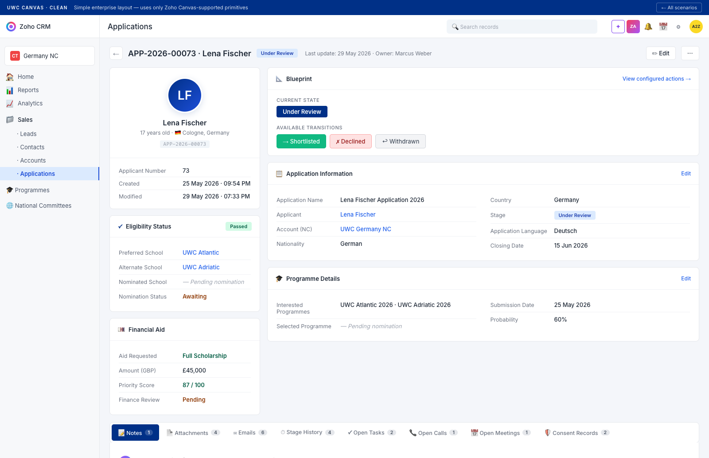

# UWC Application — Zoho CRM Canvas Design

A single clean, enterprise-grade Canvas Builder design for the Applications module. **Uses only standard Zoho Canvas-supported primitives** — no custom charts, sparklines, KPI tiles, or anything that would require Analytics or custom HTML/JS injections.

## The design

**Layout overview:**

| Region | Purpose | Implemented as |
|---|---|---|
| Top toolbar | App ID + Applicant name + Stage pill + Owner + last update + Edit/⋯ buttons | Standard Canvas header block + text fields |
| Left column (340px fixed) | Identity card · Eligibility · Financial Aid | 3 stacked Canvas section cards with field rows |
| Right column (flex) | Blueprint · Application Information · Programme Details | 3 stacked Canvas section cards. Blueprint uses the built-in Blueprint widget. |
| Below the grid | Notes · Attachments · Emails · Stage History · Tasks · Calls · Meetings · Consent | Standard Zoho related-list tab strip — every tab is a built-in related list |
| Active tab body | Note list + Add-a-note input | Standard related-list display + inline-create form |

**Total components:** 5 section cards + 1 Blueprint widget + 1 related-list tab strip. Every one of these is a drag-drop component in Canvas Builder. Nothing custom.

## What's different from the previous prototype

| Element | Previous (purple) | Clean |
|---|---|---|
| Hero | Purple gradient strip · big empty 220×220 avatar | Removed — replaced by a slim toolbar + 80px avatar inside the identity card |
| Eligibility | Lots of "—" placeholders looked empty | Fields populated with actual UWC data (Preferred + Alternate school + Nomination status) |
| Blueprint | Current State + 2 transition buttons (Under Review / Declined) | Same pattern, refined — 3 transitions (Shortlisted / Declined / Withdrawn) colour-coded |
| Application Information | Not visible in the prototype | Added as a 2-column section card below Blueprint |
| Programme Details | Not visible | Added as separate section card |
| Right rail | Empty white space | Used for Blueprint + sections — no wasted space |
| Tabs | 7 tabs · all useful | Same 7 tabs · added Stage History + Consent Records (UWC-specific) |
| Colours | Purple `#7c3aed` | UWC navy `#003087` for accents · status colours unchanged |

## Why this is Canvas-implementable

Zoho Canvas Builder supports these components (Settings → Customization → Canvas → drag from left palette):

- **Field** — any record field, drag onto canvas
- **Section** — grouped fields with header
- **Subform** — for related child records
- **Related List** — auto-renders Zoho's built-in related list tabs (Notes, Attachments, Tasks, Calls, Meetings, Emails, etc.)
- **Blueprint** — the built-in workflow display (Current state + Transitions)
- **Image / Logo** — for avatars, brand marks
- **Text block** — static labels, headers
- **Button** — system actions (Edit, Send Mail) and custom buttons
- **Background colour / image** — per section or per canvas

Everything in this design maps 1-to-1 to those components.

What you **can't** do in Canvas (and what my earlier 3 designs wrongly assumed):
- ❌ Sparkline / mini-chart inside a record detail (those live in Analytics / Reports module)
- ❌ Donut / pie chart in the canvas
- ❌ Calculated KPI tiles with delta indicators (need formula fields + custom CSS)
- ❌ Multi-column 6-cell metric grids with progress bars
- ❌ "Days in Stage" inline computation without a formula field

For the v5.3 wireframe and demo, we built those richer elements in HTML because we control the rendering. Inside actual Zoho CRM Canvas Builder, we must stay within the drag-drop palette.

## How to implement in Zoho CRM EU DC

1. **Settings → Customization → Canvas → Applications module → Create New**
2. **Layout:** "Two-column" template
3. **Left column (340px):** drop 3 Section cards:
   - **Identity** — drag Image (Applicant Photo) + Text (Lena Fischer) + Text (17 yrs · Cologne) + Field (Applicant Number)
   - **Eligibility Status** — drag fields: Eligibility Status, Preferred School, Alternate School, Nominated School, Nomination Status
   - **Financial Aid** — drag fields: Aid Requested, Amount (GBP), Priority Score, Finance Review Status
4. **Right column (flex):**
   - **Blueprint** — drag the Blueprint component (Zoho auto-renders Current State + Transitions for the configured Blueprint)
   - **Application Information** — Section card with 8 fields in 2-col layout (Application Name, Applicant, Account, Nationality, Country, Stage, Application Language, Closing Date)
   - **Programme Details** — Section card with 4 fields (Interested Programmes, Selected Programme, Submission Date, Probability)
5. **Below the grid:** drag Related List component — select which related lists to show (Notes, Attachments, Emails, Stage History, Open Tasks, Open Calls, Open Meetings, Consent Records)
6. **Style:**
   - Set Canvas background to `#f4f6fa`
   - Card backgrounds white with 8px corner radius
   - Use UWC navy `#003087` as accent (header icons, current Blueprint state pill, "Add" button)
7. **Assign canvas:** Profiles → NC Administrator + IO Super Admin (everyone else gets the standard Zoho layout, or a more restricted version)

## Files

- `design-clean.html` — the working mockup
- `screenshots/design-clean.png` — full-page render
- `_shared.css` — shared design tokens used by this mockup
- `archived/` — the 3 earlier over-complex designs (Pipeline Card / Tabbed Detail / Dashboard) — kept for reference but not for production. They include custom charts and grids that aren't Canvas Builder primitives.

## Iteration

Open `design-clean.html` in any browser. If you want any of these tweaks, say the word:
- Swap UWC navy for the original purple `#7c3aed`
- Move Eligibility / Financial Aid to the right column instead of left
- Make the layout single-column for a narrower screen
- Add additional fields to any section
- Replace the Blueprint card with an inline horizontal stage strip (note: this would require a formula-driven custom Canvas HTML block, not drag-drop — but still doable)
