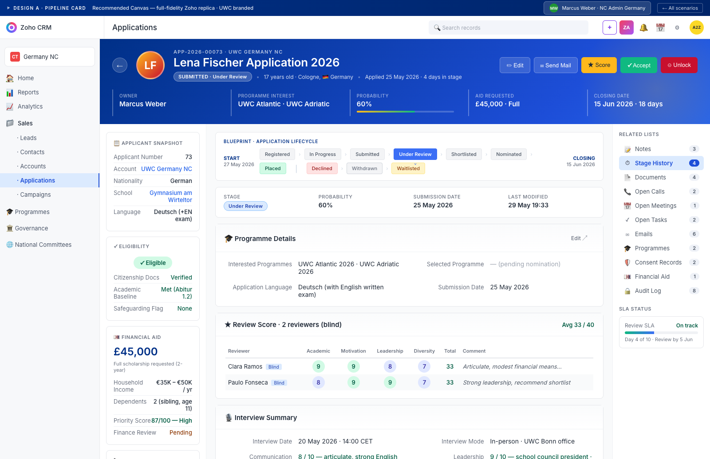
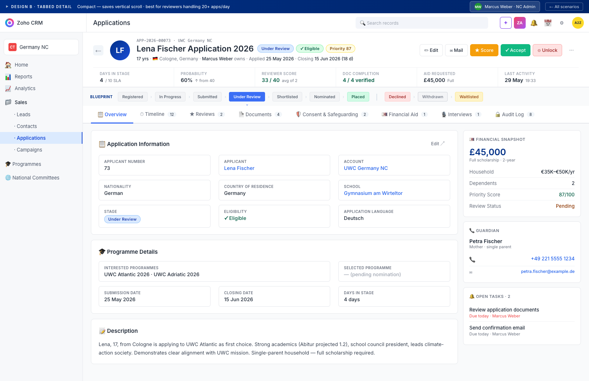
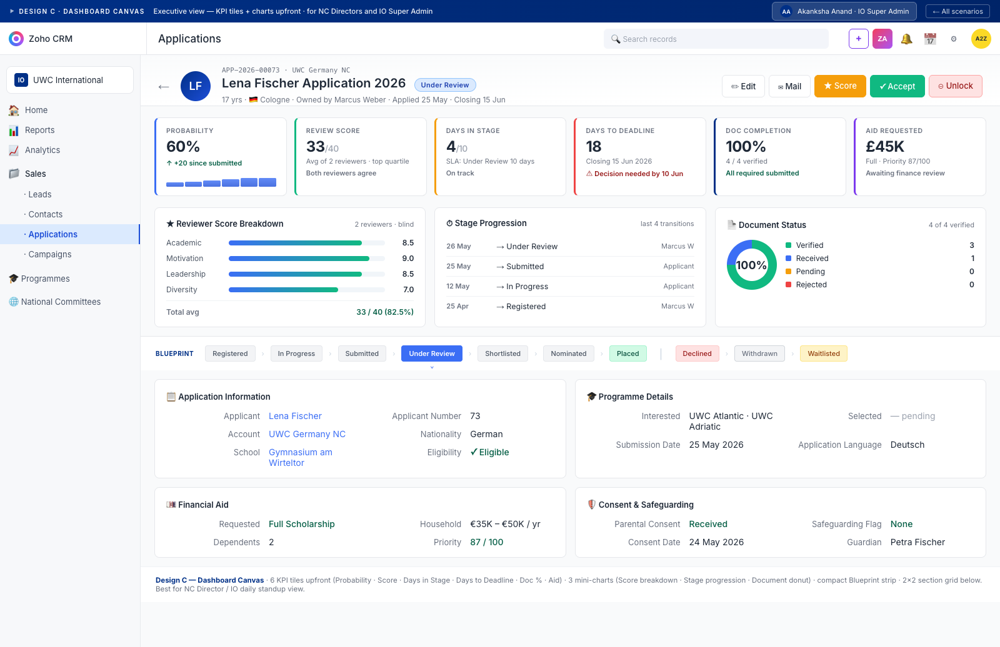

# UWC Application — Zoho CRM Canvas Designs

Three Canvas Builder designs for the Applications module, each tuned to a different UWC role and workflow. All three replace the generic Zoho record-detail page with an information-dense, UWC-branded layout.

## Why Canvas?

Zoho's default record detail is generic — fields stacked in a 1-column or 2-column grid, no visual hierarchy beyond bold labels. Canvas Builder lets you design a fully custom page per layout, drag-dropping fields, sections, related lists, charts, and embedded images on a free-form canvas.

For UWC, Canvas matters because:

- **Selectors handle 20+ applications/day** — they need at-a-glance scoring + stage + eligibility, not a wall of fields
- **NC Admins need pipeline visibility** — Blueprint progress, days-in-stage, doc completion %
- **IO Super Admins need executive view** — KPI tiles, charts, cross-NC comparison
- **Data Protection Lead needs minimum-data view** — sensitive fields hidden, audit visible
- **Brand alignment** — UWC navy #003087 + red #C8102E throughout vs Zoho's default purple

## Current design (Pranesh's prototype) — feedback

Looking at the screenshot Pranesh shared, current Canvas has:

| Element | What it does well | What needs improvement |
|---|---|---|
| Purple hero strip with APP ID + Submitted pill | Establishes record identity quickly | Off-brand colour (UWC is navy, not purple) · big empty avatar wastes 220×220 px · no key metrics visible |
| Blueprint card (Current State + Transitions) | Clear current stage + next actions | Lacks visual progress — needs the full 10-stage horizontal strip so you see where in the pipeline this app is |
| Eligibility Status card | Card grouping is good | Lots of "—" placeholders feels empty; should consolidate or hide blanks |
| Notes/Attachments/Emails/Tasks/Calls/Meetings tabs | Standard Zoho related-list pattern works | Missing key UWC-specific lists: Reviews · Stage History · Training Records · Consent Records · Audit Log |
| Right side | — | Wasted real estate — should hold related-list rail or summary cards |
| Hero metrics | — | Missing: Programme Interest · Probability · Aid Requested · Closing Date · SLA — these are decision-critical at-a-glance |

**Verdict:** Solid bones, but needs more density + UWC branding + horizontal Blueprint strip + role-appropriate metric tiles. The three designs below address these in different ways.

## The three Canvas designs

### Design A — Pipeline Card (recommended for most users)

**Best for:** NC Admin (Marcus), IO Super Admin (Akanksha), Selection Committee members — the everyday operational view.

**Layout:**
- **Hero (UWC navy gradient, 160px)** — back chevron · 64px gradient avatar with initials · APP ID + applicant name + stage pill · 5 role-gated action buttons (Edit / Mail / Score / Accept / Unlock) · 5 hero metrics (Owner · Programme Interest · Probability w/ progress bar · Aid Requested · Closing Date)
- **3-column body** —
  - **Left rail (240px):** Applicant Snapshot · Eligibility status card · Financial Aid summary with big £ figure · Guardian Contact
  - **Centre (flexible):** Full 10-stage Blueprint strip with START + CLOSING markers · 4-cell quick info card · Programme Details section · Review Score subform (2 reviewers, blind, scored circles) · Interview Summary
  - **Right rail (220px):** 11 related lists with counts · SLA status mini-chart at bottom

**Why it wins:**
- Highest information density without feeling cluttered
- Hero metrics surface the 5 decisions every reviewer needs
- Blueprint strip visualises pipeline position immediately
- 3-column layout uses full 1600px width
- Mirrors the layout we built into v5.3 of the wireframe

### Design B — Tabbed Detail (compact)

**Best for:** High-volume reviewers (Clara, Paulo) processing 20+ applications/day — they need to swap context fast without scrolling.

**Layout:**
- **Compact hero (white background, 130px)** — smaller 54px avatar · name with 3 inline status pills (Stage · Eligibility · Priority Score) · one-line metadata strip · 6 action buttons
- **6-cell metric strip** — Days in Stage · Probability · Reviewer Score · Doc Completion · Aid Requested · Last Activity
- **Compact Blueprint strip** below
- **Tab strip (8 tabs)** — Overview · Timeline · Reviews · Documents · Consent · Financial Aid · Interviews · Audit Log — each loads only its relevant sections
- **2-column tab body** — left: dense field grid in card-style cells; right: 3 summary cards (Financial Snapshot · Guardian · Open Tasks)

**Why it works:**
- Saves ~600px of vertical scroll vs Design A
- Tab pattern is muscle-memory for Zoho power users
- Dense cell grid shows more fields per screen
- Sticky hero + tabs means metrics never scroll out of view

### Design C — Dashboard Canvas (executive)

**Best for:** IO Super Admin daily standups · NC Director board meetings · executive scan view. Tells the application story in 6 numbers + 3 mini-charts before any field detail.

**Layout:**
- **Minimal hero (90px)** — smaller avatar · name + Stage pill · one-line context · 5 action buttons
- **6 KPI tiles** — Probability (with 6-bar sparkline · ↑ delta), Review Score (33/40), Days in Stage (4/10 SLA), Days to Deadline (18, red warning), Doc Completion (100%), Aid Requested (£45K). Each tile has accent stripe left border + delta indicator.
- **3 mini-charts row** — Reviewer Score Breakdown (4 horizontal score bars) · Stage Progression timeline (last 4 transitions) · Document Status donut chart (100% with 4-colour legend)
- **Compact Blueprint strip** in white record-strip band
- **2×2 section grid** below — Application Info · Programme Details · Financial Aid · Consent & Safeguarding

**Why it stands out:**
- Tells the story in numbers + charts before any field
- Sparklines + donut chart give visual texture without being gimmicky
- "Decision needed by 10 Jun" red callout makes urgency obvious
- Perfect for screen-sharing in standup or board prep

## How to implement in Zoho CRM EU DC

For each layout, in Zoho Setup:

1. **Settings → Customization → Canvas → Applications module → New Canvas**
2. **Choose layout:** Pranesh's existing layout becomes the base
3. **Per design:**
   - Drag the hero into a fixed-height block (use a gradient background from the CSS hex codes)
   - Use Canvas's "Subform" component for the Review Score table
   - Use Canvas's "Related List" component for the related-list rail
   - For KPI tiles in Design C, use Canvas's "Calculated Field" component pointing at formula fields (e.g., `Probability` is already a Zoho field; `Days in Stage` = `TODAY() - LAST_STAGE_CHANGE_DATE`)
4. **Assign to profile:** Each design is profile-scoped so different roles see different canvases:
   - Design A → NC Administrator + IO Super Admin profiles
   - Design B → Reviewer + Selection Committee profiles
   - Design C → IO Super Admin (additional view, toggleable from layout switcher)
5. **Test:** Open any Application record while logged in as each user type — Canvas should render that profile's assigned layout

## Files

- `_shared.css` — shared design system (UWC palette, Zoho chrome, Blueprint strip, buttons)
- `design-A-pipeline-card.html` — Design A mockup
- `design-B-tabbed-detail.html` — Design B mockup
- `design-C-dashboard.html` — Design C mockup
- `screenshots/*.png` — Full-page screenshots of each design

Open any HTML file in a browser to interact (UWC navy chrome, role switcher in demo bar). They're static mockups — no JS interactivity, just for Canvas design review.

## Recommendation

**Ship Design A as the default Canvas for the Applications module**, with Design B available to Reviewer profiles via the layout switcher. Hold Design C for a Phase 2 conversation about cross-app dashboards in the Analytics module — it's more dashboard than record-detail and arguably belongs in a Reports/Analytics canvas, not the per-record view.
