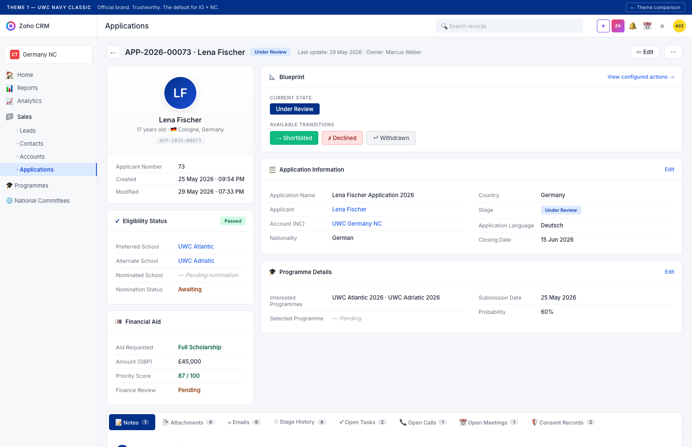
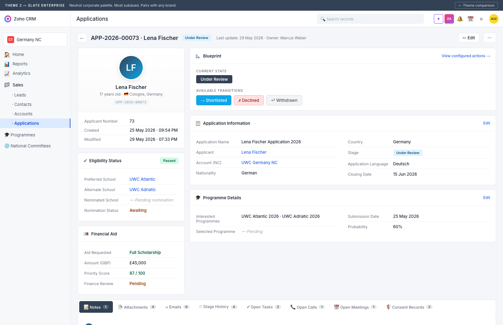
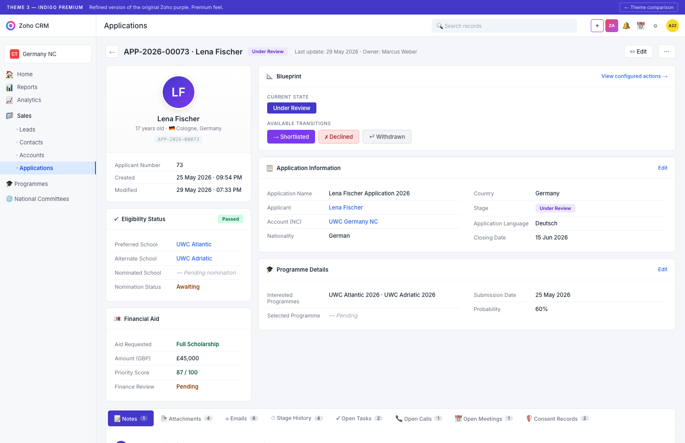
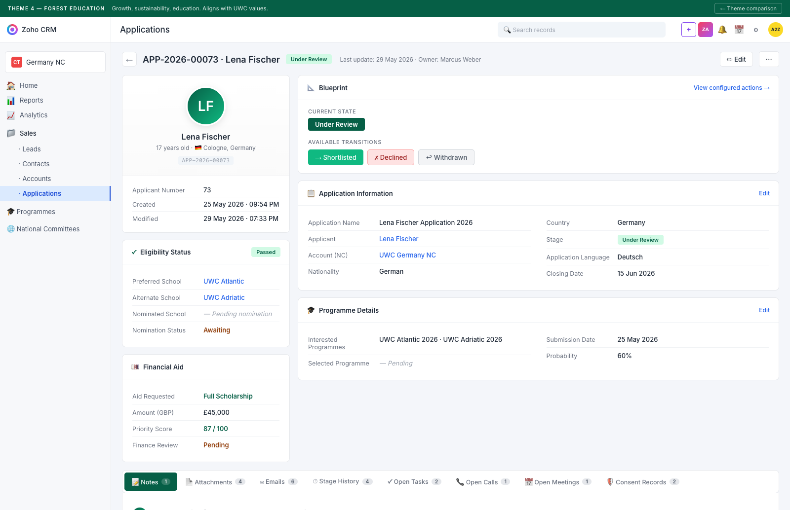
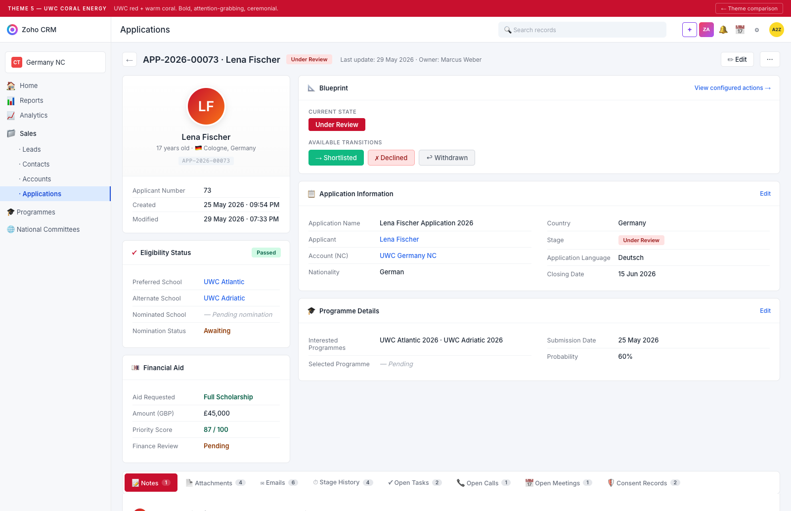

# UWC Application Canvas — 5 Theme Options

Same enterprise-grade layout (the one approved as `design-clean.html`), 5 distinct colour themes to pick from. Every theme uses only standard Zoho Canvas Builder primitives — no custom charts, no sparklines, no widgets that need formula + HTML hacks.

**Pick one theme; the rest are throwaway.** All 5 are mechanically identical — only the CSS palette differs.

---

## Theme 1 — UWC Navy Classic



**Palette**

| | |
|---|---|
| Primary | `#003087` UWC navy |
| Accent | `#1d4ed8` royal blue |
| Avatar gradient | navy → bright blue |
| Mood | Official, trustworthy, brand-aligned |

**Best for:** the default Canvas for everyone. Aligns with the UWC International brand book and your existing demo-bar/scope-banner colours from the wireframes.

---

## Theme 2 — Slate Enterprise



**Palette**

| | |
|---|---|
| Primary | `#334155` slate |
| Accent | `#0ea5e9` sky blue |
| Avatar gradient | slate → sky |
| Mood | Neutral corporate. Most subdued. Pairs with any brand. |

**Best for:** if UWC ever feels the navy is too dominant or wants the CRM to feel less "branded" and more "boardroom". This is what most SaaS B2B products look like.

---

## Theme 3 — Indigo Premium



**Palette**

| | |
|---|---|
| Primary | `#4338ca` indigo |
| Accent | `#7c3aed` violet |
| Avatar gradient | indigo → violet |
| Mood | Refined premium. Closer to your original Zoho purple but more polished. |

**Best for:** if your prototype's purple was the intended look. This is the same family but with deeper indigo so it doesn't read as "default Zoho demo".

---

## Theme 4 — Forest Education



**Palette**

| | |
|---|---|
| Primary | `#065f46` emerald deep |
| Accent | `#10b981` emerald bright |
| Avatar gradient | emerald → teal |
| Mood | Growth, sustainability, education. Aligns with UWC's values narrative. |

**Best for:** if leadership wants the CRM to *feel* like education + growth, not corporate. Pairs well with UWC's climate-action and global-citizenship messaging.

---

## Theme 5 — UWC Coral Energy



**Palette**

| | |
|---|---|
| Primary | `#C8102E` UWC red |
| Accent | `#f97316` warm coral |
| Avatar gradient | red → orange |
| Mood | Bold, attention-grabbing, ceremonial. Uses the UWC secondary brand colour. |

**Best for:** high-energy surfaces — Selection Committee meeting screens, campaign dashboards, Davis Programme stewardship pages. Probably *too* bold for daily operational view.

---

## What's identical across all 5

- Top toolbar with APP ID + Stage pill + Owner + Edit / ⋯
- Left 340px column: Identity card (80px avatar) + Eligibility Status card + Financial Aid card
- Right flex column: Blueprint widget (Current State + 3 transitions) + Application Information (8 fields in 2-col) + Programme Details (4 fields in 2-col)
- Below: 8-tab related-list strip (Notes · Attachments · Emails · Stage History · Tasks · Calls · Meetings · Consent Records)
- Same Lena Fischer sample data throughout
- Same Zoho chrome (topbar, sidebar, module nav)

## What changes per theme

Only the CSS variables in the `:root` block. The 6 themed values per design are:

```css
--primary       /* toolbar, "Add" button, active tab background, Current state pill */
--primary-deep  /* hover state */
--accent        /* secondary highlights */
--avatar-grad   /* identity avatar + note author avatars */
--current-bg    /* Blueprint Current State badge */
--pill-bg + --pill-text  /* Under Review pill in the toolbar + Application Info */
```

That means once a theme is picked, **swapping is a 1-line change in Canvas Builder** — update the colour token, the whole canvas re-skins.

## Implementation in Zoho

Same 7-step build as `design-clean.html` (see `../README.md`). The only difference per theme is the colour codes you enter in Canvas Builder's Background/Border/Text colour pickers for each section.

## Files

```
themes/
  theme-1-navy-classic.html
  theme-2-slate-enterprise.html
  theme-3-indigo-premium.html
  theme-4-forest-education.html
  theme-5-coral-energy.html
  screenshots/                  ← 1600px full-page PNGs of each
  README.md                     ← this file
build_themes.py                 ← Python generator (single template + 5 theme dicts → 5 HTML files)
```

Open any HTML to interact. Re-run `python3 build_themes.py` to regenerate after editing the template or theme palette.

---

## My recommendation

**Theme 1 (Navy Classic)** as the default — it matches every other artefact we've built (Scenario A wireframe, Excel dataset, Canvas hero bar, demo-bar). One brand voice across the demo.

If leadership wants the canvas to feel "less corporate, more mission-driven" → **Theme 4 (Forest Education)**.

Avoid Theme 5 (Coral Energy) for the day-to-day operational canvas — save it for special pages.
